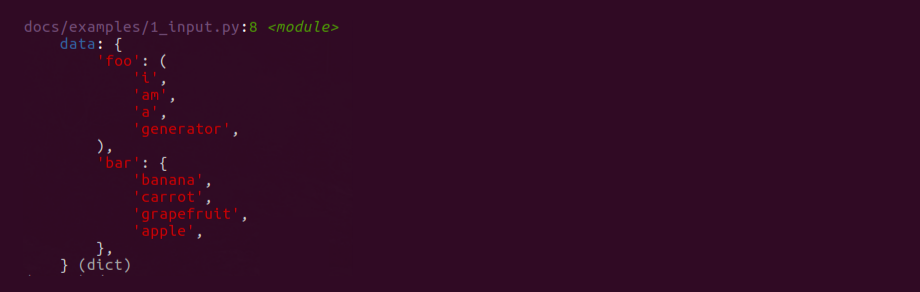
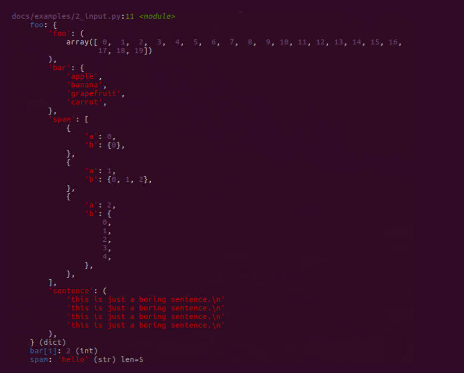

python-devtools
===============

.. toctree::
   :maxdepth: 2

|pypi| |license|

Current Version: |version|

Dev tools for python.

The debug print command python never had (and some other handy tools).

Install
-------

Assuming you have **python 3.5+** and pip installed, just::

    pip install devtools

If ``pygments`` is installed *devtools* will colourise output to make it even more readable.
Chances are you already have pygments installed if you're using ipython, otherwise it can be installed along
with *devtools* via ``pip install devtools[pygments]``.

Debug print
-----------

Somehow in the 26 years (and counting) of activity development of python, no one thought to add a simple
and readable way to print stuff during development. (If you know why this is, I'd love to hear an explanation).

The wait is over:

.. literalinclude:: examples/1_input.py

Will output:

``debug`` is like ``print`` on steroids, and coffee, and some orange pills
you found down the back of a chair on the tube:

* Each output it prefixed with the file, line number and function where ``debug`` was called
* the variable name or expression being printed is shown
* each argument is printed "pretty" on a new line
* if ``pygments`` is installed the output will be highlighted

Complex usage
.............

a more complex example of ``debug`` shows more of what it can do.

.. literalinclude:: examples/2_input.py

Will output:

Usage without import
....................

We all know the annoyance of running code only to discover a missing import, this can be particularly
frustrating when the function you're using isn't used except during development.

You can setup your environment to make ``debug`` available at all times by editing ``sitecustomize.py``,
with ubuntu and python3.6 this file can be found at ``/usr/lib/python3.6/sitecustomize.py`` but you might
need to look elsewhere depending on your OS/python version.

Add the following to ``sitecustomize.py``

.. literalinclude:: examples/sitecustomize.py

The ``ImportError`` exception is important since you'll want python to run fine even if *devtools* isn't installed.

This approach has another advantage: if you forget to remove ``debug(...)`` calls from your code, CI
(which won't have devtools installed) should fail both on execution and linting, meaning you don't end up with
extraneous debug calls in production code.

Other Tools
-----------

Prettier print
..............

Python comes with `pretty print <https://docs.python.org/3/library/pprint.html>`_, problem is quite often
it's not that pretty, it also doesn't cope well with non standard python objects (think numpy arrays or
django querysets) which have their own pretty print functionality.

To get round this *devtools* comes with prettier print, my take on pretty printing. You can see it in use above
in ``debug()``, but it can also be used directly:

.. literalinclude:: examples/prettier.py

For more details on prettier printing, see
`prettier.py <https://github.com/samuelcolvin/python-devtools/blob/master/devtools/prettier.py>`_.

ANSI terminal colours
.....................

.. literalinclude:: examples/ansi_colours.py

For more details on ansi colours, see
`ansi.py <https://github.com/samuelcolvin/python-devtools/blob/master/devtools/ansi.py>`_.

.. include:: ../HISTORY.rst

.. |pypi| image:: https://img.shields.io/pypi/v/python-devtools.svg
   :target: https://pypi.python.org/pypi/python-devtools
.. |license| image:: https://img.shields.io/pypi/l/python-devtools.svg
   :target: https://github.com/samuelcolvin/python-devtools
